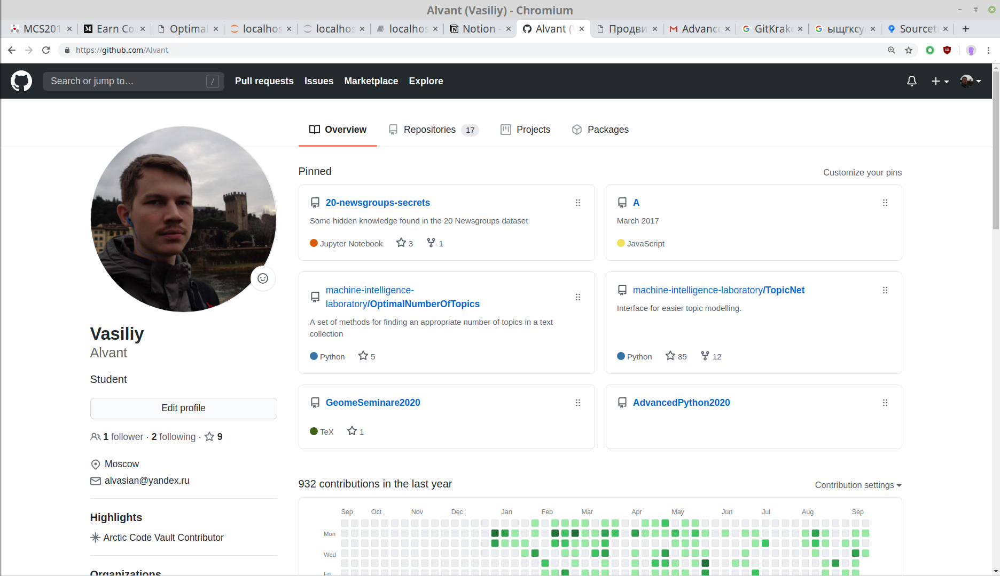

# Lab 1. Python Intro


## Задача

Через стандартный ввод (с помощью клавиатуры) на вход программе подаётся
строка из чисел, разделённых пробелами.
Надо вывести упорядоченный ряд квадратов этих чисел, без повторений.

Например

Вход     | Выход
---------| ------
0        | 0
1 2      | 1 4
-3 1     | 1 9
1 2 2    | 1 4
1.1      | 1.21


### Пара требований к оформлению

Если используете функции, надо указывать типы параметров и возвращаемый тип.
Переменным надо давать читаемые, осмысленные имена (но иногда допускаются и короткие, например `i` допустимо использовать как счётчик цикла).


## Введение в Git


### Установка

Устанавливаем Git на машину.
На Ubuntu это должно быть совсем просто: `sudo apt install git`.
На Windows тоже всё ставится, например, про установку Git-а на Windows пара слов сказано [тут](https://git-scm.com/book/ru/v2/%D0%92%D0%B2%D0%B5%D0%B4%D0%B5%D0%BD%D0%B8%D0%B5-%D0%A3%D1%81%D1%82%D0%B0%D0%BD%D0%BE%D0%B2%D0%BA%D0%B0-Git).
Правда, при работе на Windows могут возникнуть быть проблемы с тем, что Git установлен, но в консоли команда `git` всё равно не распознаётся.
Если окажется так, то надо будет проверить, добавлен ли путь до Git в `PATH`.
Для этого надо, например, зайти в `Панель управления\Система и безопасность\Система\Дополнительные параметры системы` и там кликнуть "Переменные среды", и там будет настройка `PATH`.
В `PATH` надо добавить путь до бинарника с Гитом (куда он установился).
Советы по настройке `PATH`, в частности для работы с Гитом, несложно найти.
Например, что-то про это сказано [тут](https://stackoverflow.com/questions/26620312/git-installing-git-in-path-with-github-client-for-windows).

Если не хочется особо возиться с Гитом, изменять `PATH` и т.п., то можно ещё сделать так.
Для Windows есть удобная Unix-like консоль [Cmder](https://cmder.net).
При скачивании есть вариант "Download Full (with Git for Windows)".
Если это скачать, установить, запустить Cmder, то на машине бесплатно появится и Git.
Правда, команда `git` будет работать только в консоли Cmder.

Проверить, что вы можете работать с Git через терминал, можно, выполнив команду
```bash
which git
```
которая укажет путь до исполняемого файла, или просто
```bash
git
```
которая выведет небольшую справку по Гиту, какие команды есть, как вызывать.


### Создание репозитория

Заходим на страницу своего профиля на Гитхаб:


Создаём репозиторий:


Даём ему имя, можем добавить README, файл с лицензией (лучше хоть какой-то файл создать на всякий случай, чтобы репозиторий был непустой).
Например, добавим MIT лицензию:


Репозиторий создан:


Копируем адрес репозитория:


На своём компьютере переходим в рабочую директорию:


И создаём локальный клон репозитория:


Клонирование завершено:


Переходим в созданную папку с репозиторием и проверяем статус `git status`:


### Небольшое техническое отступление для организации сдачи задания с помощью Гитхаба

Чтобы семинарист мог оставлять комментарии к пуллреквестам, надо добавить его в участники репозитория.
Для этого надо сначал открыть настройки репозитория:


Потом в настройках открыть вкладку "Добавить участника":


И далее надо добавить семинариста по его имени на Github `@Alvant`, с правами Write.

Чтобы при создании пуллреквеста семинарист автоматически добавлялся как ревьюер, надо создать файл `CODEOWNERS` и записать ту же ссылку на Гитхаб аккаунт, что использовали ранее при добавлении участника `@Alvant`:


Добавляем файл `CODEOWNERS` в список файлов, которые мы далее закоммитим, с помощью команды `git add`.
Проверяем статус (на всякий случай).
Коммитим файл, добавляя к коммиту поясняющее сообщение (коммит — запись, сохранение изменений).
Опять проверяем статус:


Пушим локальные изменения на Гитхаб:


Теперь на сайте есть файл `CODEOWNERS`:


### Оформление задания на Гитхабе

Создаём рабочую ветку и переходим на неё `git checkout -b <branch name>` (`checkout` — переход на ветку, флаг `-b` — "ветка новая, надо её сначала создать").


Оформляем задание в файле, и оформляем его в локальном Гите (`git add`, `git commit`).
В примере на картинке создаётся пустой файл — это просто ради демонстрации.


Пушим (если попробовать сделать просто `git push`, то Гит будет ругаться — надо просто следовать его рекомендациям):


Изменения опубликованы на сайте (там же есть кнопка "создать пуллреквест"):


Если работа над заданием закончена, то создаём pullrequest (сливаем рабочую ветку в основную — в master):


Реквест создан:


Можно посмотреть, какие изменения в рабочей ветке по сравнению с целевой веткой (master):


Потом в реквесте можно будет общаться, комментировать и т.п.

### Когда реквест завершён

Реквест создаётся для того, чтобы обсудить изменения, поправить что-то, если что не так, и объединить изменения из рабочей ветки с основной веткой (`master`).
После одобрения реквеста и его мёрджа изменения как раз переходят в основную ветку.
Но `master` меняется удалённо.
Чтобы и локальная копия `master` (на рабочей машине) обновилась, необходимо перейти с рабочей ветки обратно на `master`:
```bash
git checkout master
```
и подтянуть изменения с удалённого репозитория (где смёржился пуллреквест)
```bash
git pull
```

После этого можно снова создавать рабочие ветки, делать новые задания и т.д.


### NB

* В Гит не надо добавлять лишние файлы (особенно какие-нибудь большие файлы). По этой части может помочь файл `.gitignore`

* Чтобы случайно не запушить задание в master без реквеста, можно настроить branch protection rules в настройках репозитория ("просто так коммитить нельзя — изменения можно добавлять только через пулреквесты"):


## Ссылки

* [Powerful Python One-Liners](https://wiki.python.org/moin/Powerful%20Python%20One-Liners) — пара крутых питонских однострочников ("обратить словарь в одну строчку")
* [Cmder](https://cmder.net/) — Unix-like консоль на Windows
* [Learn Git Branching](https://learngitbranching.js.org/?locale=ru_RU) — классная интерактивная Гит-обучалка (`git add`, `git commit`, `git cherry-pick`, `git rebase` & many more)


## Git GUI

При описании работы с Git-ом, а уже тем более Git-ом на Windows, стоит ещё упомянуть о таких программах, как [Sourcetree](https://www.sourcetreeapp.com/) и [GitKraken](https://www.gitkraken.com/) — это GUI обёртки над самим Гитом.
Они удобны в том плане, что там всё наглядно, видны все ветки, вся эволюция репозитория как история коммитов и объединений веток.
Но получить практику работы с Гитом через терминал тоже небесполезно.
Так, в каких-то не совсем тривиальных случаях "сделать напрямую через Гит" может быть проще, чем через GUI интерфейс.
