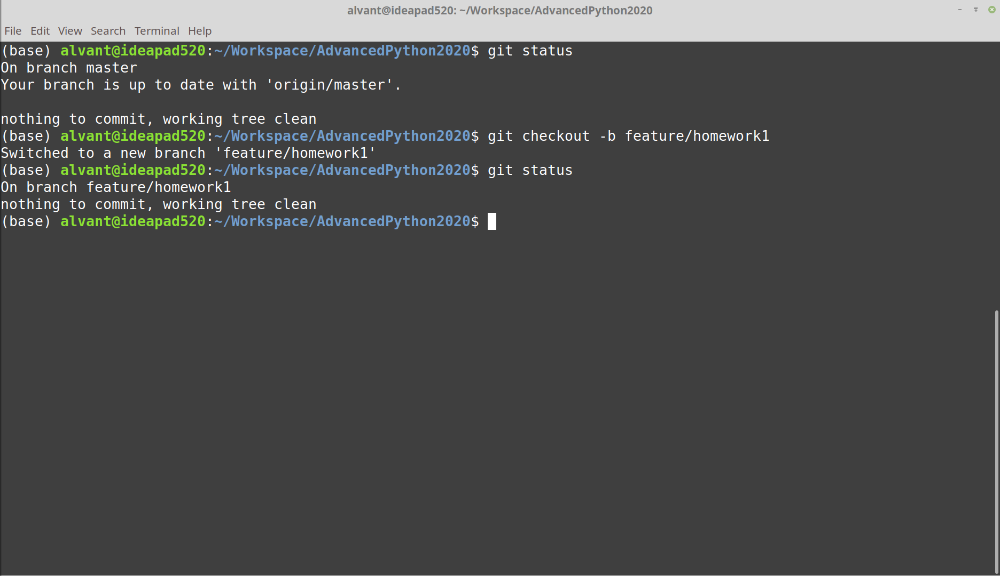

# Lab 1

## Problem

Через стандартный ввод (с помощью клавиатуры) на вход программе подаётся
строка из чисел, разделённых пробелами.
Надо вывести упорядоченный ряд квадратов этих чисел, без повторений.

Например

Вход     | Выход
---------| ------
0        | 0
1 2      | 1 4
-3 1     | 1 9
1 2 2    | 1 4
1.1      | 1.21

### Пара требований к оформлению

Если используете функции, надо указывать типы параметров и возвращаемый тип.
Переменным надо давать читаемые, осмысленные имена (но иногда допускаются и короткие, например `i` допустимо использовать как счётчик цикла).

## Git Intro

Заходим на страницу своего профиля на Гитхаб:

Создаём репозиторий:

Даём ему имя, можем добавить README, файл с лицензией (лучше хоть какой-то файл создать на всякий случай, чтобы репозиторий был непустой).
Например, добавим MIT лицензию:

Репозиторий создан:

Копируем адрес репозитория:

На своём компьютере переходим в рабочую директорию:

И создаём локальный клон репозитория:

Клонирование завершено:

Переходим в созданную папку с репозиторием и проверяем статус `git status`:

Для рабочих целей создадим файл `CODEOWNERS` и запишем туда ссылку на Гитхаб аккаунт семинариста:

### Небольшое техническое отступление для организации сдачи задания с помощью Гитхаба

Добавляем файл `CODEOWNERS` в список файлов, которые мы далее закоммитим, с помощью команды `git add`.
Проверяем статус (на всякий случай).
Коммитим файл, добавляя к коммиту поясняющее сообщение (коммит — запись, сохранение изменений).
Опять проверяем статус:

Пушим локальные изменения на Гитхаб:

Теперь на сайте есть файл `CODEOWNERS`:

### Оформление задания на Гитхабе

Создаём рабочую ветку и переходим на неё `git checkout -b <branch name>` (`checkout` — переход на ветку, флаг `-b` — "ветка новая, надо её сначала создать").

Оформляем задание в файле, и оформляем его в локальном Гите (`git add`, `git commit`).
В примере на картинке создаётся пустой файл — это просто ради демонстрации.

Пушим (если попробовать сделать просто `git push`, то Гит будет ругаться — надо просто следовать его рекомендациям):

Изменения опубликованы на сайте:

Если работа над заданием закончена, то создаём pullrequest (сливаем рабочую ветку в основную — в master):

Реквест создан:

Можно посмотреть, какие изменения в рабочей ветке по сравнению с целевой веткой (master):

Потом в реквесте можно будет общаться, комментировать и т.п.

### NB

* В Гит не надо добавлять лишние файлы (особенно какие-нибудь большие файлы). По этой части может помочь файл `.gitignore`

* Чтобы случайно не запушить задание в master без реквеста, можно настроить branch protection rules в настройках репозитория ("просто так коммитить нельзя — изменения можно добавлять только через пулреквесты"):

## Ссылки

* Пара крутых питонских однострочников ("обратить словарь в одну строчку"): [Powerful Python One-Liners](https://wiki.python.org/moin/Powerful%20Python%20One-Liners)
* Unix-like консоль на Windows: [Cmder](https://cmder.net/)
* Классная интерактивная Гит-обучалка (`git add`, `git commit`, `git cherry-pick`, `git rebase` & more): [Learn Git Branching](https://learngitbranching.js.org/?locale=ru_RU)
