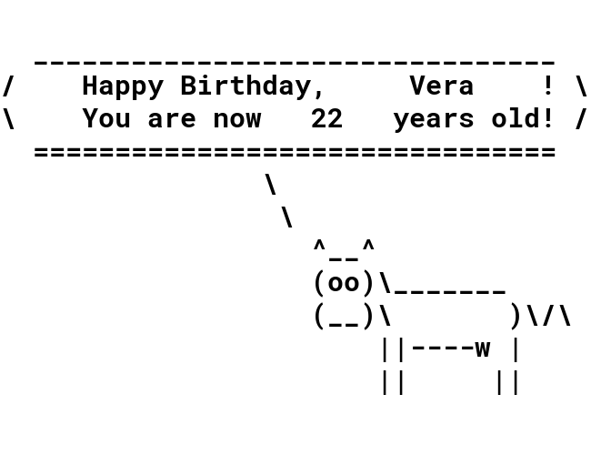

# Lab 4. Argparse & Decorators

[Демо ноутбук с лабы](./demo/Argparse.ipynb).

По заданию достаточно решить две задачи: одну по `argparse` (задача 1, 2 или 3) и одну по декораторам (задача 5).


## Задача 1 («‎Florist's»‎)

Напишите программу, сохраняющую некоторую информацию о цветке в файл.
Оформите её так, чтобы была возможность запуска из командной строки с передачей аргументов.

Например, пусть скрипт называется `add_flower.py`, а информация записывается в файл `journal.txt`.
Тогда должна быть возможность многократного запуска (в примере ниже — после запуска программы выводится содержимое файла `journal.txt`):
```bash
$ python add_flower.py \
>   --name Rose \
>   --country Holland \
>   --petal-colour R \
>   --stem-length 70 \
>   --with-thorns \
>   --companion-plants Solomio Snapdragon Calla_Lily

$ cat journal.txt
{"name": "Rose", "country": "Holland", "petal-colour": "R", "stem-length": 70, "with-thorns": true, "companion-plants": ["Solomio", "Snapdragon", "Calla_Lily"]}

$ python add_flower.py \
>   --name Camomile \
>   --country Russia \
>   --petal-colour W \
>   --stem-length 50

$ cat journal.txt
{"name": "Rose", "country": "Holland", "petal-colour": "R", "stem-length": 70, "with-thorns": true, "companion-plants": ["Solomio", "Snapdragon", "Calla_Lily"]}
{"name": "Camomile", "country": "Russia", "petal-colour": "W", "stem-length": 50, "with-thorns": false, "companion-plants": None}
```


### Описание параметров командной строки

* `--name`: название (строка; обязательный).
* `--country`: страна (строка; обязательный).
* `--petal-colour`: цвет лепестка (строка, может принимать *всего пять* возможных значений: `"R"` (красный), `"W"` (белый), `"Y"` (жёлтый), `"V"` (фиолетовый), `"B"` (синий); обязательный).
* `--stem-length`: длина стебля в сантиметрах (целое число; обязательный).
* `--with-thorns`: есть ли шипы (булевское значение; необязательный, по умолчанию `False`). Если этот параметр *есть*, то значение `with_thorns` должно становиться `True`. То есть писать надо не напрямую `<params> --with-thorns True <other params>`, а просто `<params> --with-thorns <other params>`.
* `--companion-plants`: с какими растениями хорошо сочетается в букете (список строк; необязательный, по умолчанию `None`).


### Формат вывода

Переданная через командную строку информация должна записываться в файл.
Каждая строка — информация в формате JSON об одном цветке.
При повторных запусках программы информация дозаписывается в конец файла.


## Задача 2 («‎Chamomile Divination»‎)

Наташа хочет погадать на ромашке: "любит — не любит".
Но у Наташи свой способ гадания, "нестандартный".
Особенность Наташиной методики в том, что она использует не одну, а *несколько* ромашек.
Берёт первый цветок, выбирает, с чего начать гадать ("любит" или "не любит"), и отрывает по лепестку.
Когда лепестки на первом цветке заканчиваются, Наташа берёт следующую ромашку.
И *продолжает* гадание.
То есть если первый цветок закончился на "не любит", то следующий начнётся с "любит", и наоборот.

Помогите Наташе: напишите программу, которая по информации о цветках для гадания сможет подсказать ей, с чего надо начать гадать, чтоб всё закончилось на "любит".
(...Хотя вряд ли Наташа будет пользоваться этой программой, ведь это уже будет "не то".)
Программа должна запускаться из командной строки с передачей аргументов: количество лепестков на каждой ромашке, и слово — начало гадания.
На выходе программа должна показать, чем закончится гадание.

### Пример запуска

Пусть файл с программой называется `chamomile_divination_for_natasha.py`.
Тогда должна быть возможность запуска программы следующим образом:
```bash
$ python chamomile_divination_for_natasha.py \
>   --petal-numbers 5 2 3 \
>   --divination-start "не любит"
любит
```

То есть всего есть три цветка: на первом 5 лепестков, на втором 2, на третьем 3.
Если начать гадать с "не любит", то первая ромашка закончится на "не любит"; тогда вторая начнётся с "любит", закончится на "не любит"; и последняя ромашка начнётся с "любит", и в конце тоже будет "любит".
Поэтому вывод программы: "любит".

### Описание параметров командной строки

Программа принимает со входа следующие аргументы:

* `-p`, `--petal-numbers`: последовательность чисел, каждое из которых есть число лепестков на соответствующей ромашке (непустой список из целых чисел; обязательный).
* `-s`, `--divination-start`: слово, с которого начинается гадание (строка, может принимать *всего два* возможных значения: `"любит"` и `"не любит"` ; необязательный, по умолчанию `"любит"`).

Для каждого параметра может использоваться как короткое, так и полное имя.


## Задача 3 («‎Михаэлис — Ментен»‎)

Напишите программу `michaelis_menten.py`, [позволяющую по концентрации субстрата рассчитать скорость реакции, катализируемой ферментом](https://en.wikipedia.org/wiki/Michaelis%E2%80%93Menten_kinetics).
Программа запускается из командной строки.


### Описание параметров командной строки

Программа принимает со входа следующие аргументы:

* `-S`: концентрация субстрата, моль/л (число; обязательный)
* `-E0`: начальная концентрация фермента, моль/л (число; обязательный)
* `-KM`: константа Михаэлиса, моль/л (число; обязательный)
* `-k`: константа скорости реакции превращения фермент-субстратного комплекса в фермент и продукт, 1/с (число; обязательный)
* `--save-file`: путь до файла, куда надо *в формате JSON* сохранить рассчитанную скорость, а также переданные на вход программе аргументы (строка — путь до файла; необязательный — если путь не передали, то сохранять в файл ничего не нужно)

Вывод программы — значение скорости.

### Пример запуска

```bash
$ python michaelis_menten.py -S 0.001 -E0 1e-9 -KM 0.015 -k 0.14 --save-file ./result.json
8.75e-12
$ cat result.json
{
    "v": 8.75e-12,
    "S": 0.001,
    "E0": 1e-9,
    "KM": 0.015,
    "k": 0.14
}
```


## Задача 5 («‎Автор»‎)

Напишите декоратор `author`, который принимает на вход один строковый параметр — имя человека-автора какой-либо функции.
У функции, декорируемой `author`, должно появиться поле `_author`, содержащее переданное при инициализации декоратора имя автора функции.

Например
```python
>>> @author("Dany Longo")
>>> def add2(num: int) -> int:
...    return num + 2
>>>
>>> print(add2._author)
Dany Longo
```

### P.S.

Функции в Питоне — тоже объекты, которые могут иметь как методы, так и поля:
```python
>>> def func1():
>>>     pass
>>>
>>> func1.param1 = "17.5"  # just set some new parameter
>>>
>>> print(func1.param1)
17.5
>>>
>>> def func2():
>>>     func2.param1 = "Функции в Питоне — тоже объекты"
>>>
>>>     return
>>>
>>> func2()  # call once so as to initialize the parameter in the body
>>>
>>> print(func2.param1)
Функции в Питоне — тоже объекты
```


## Задача 6* («‎С днём рождения от коровки!»)

Если зайти в папку [cow](./cow) и запустить файл [cow.py](./cow/cow.py) с помощью команды
```bash
python cow.py
```
то будет создана картинка — поздравление с днём рождения от коровки:


(Если не запускается — возможно, надо сначала установить библиотеку [Pillow](https://pypi.org/project/Pillow): `pip install Pillow`.)

Надо доработать файл с кодом так, чтобы его можно было запускать из командной строки *с передачей аргументов*:
имени поздравляемого, его возраста, и пути, по которому должна быть сохранена картинка-поздравление.
Например:
```bash
python cow.py --name Neo --age 5 --save-path /home/neo/hbd_neo.png
```


## Задача 7* (Timeit)

Напишите декоратор `timeit`, который измеряет время выполнения декорируемой функции.
Декоратор `timeit` должен принимать один опциональный целочисленный параметр — количество запусков функции, которые надо провести, чтобы посчитать усреднённое время выполнения (по умолчанию число запусков равно единице).

Пример использования:
```python
>>> from time import sleep
>>>
>>> @timeit
>>> def slow_add(a: int, b: int) -> int:
...     sleep(1)
...
...     return a + b
>>>
>>> slow_add(1, 2)
Execution time: 1 s
3
>>>
>>> @timeit(7)
>>> def slow_add(a: int, b: int) -> int:
...     sleep(1)
...
...     return a + b
>>>
>>> slow_add(1, 2)
Execution time: 1 s +- 0.0003 s (mean ± std. dev. of 7 runs)
3
```


## Ссылки

### Argparser

* [argparse — Parser for command-line options, arguments and sub-commands](https://docs.python.org/3/library/argparse.html). Страница документации по библиотеке, с примерами (от простых к посложнее).


### Декораторы

* [Декораторы в Python: понять и полюбить](https://tproger.ru/translations/demystifying-decorators-in-python). Статья на Tproger.
* [The decorators they won't tell you about](https://github.com/hchasestevens/hchasestevens.github.io/blob/master/notebooks/the-decorators-they-wont-tell-you-about.ipynb). Ноутбук с примерами и замечаниями (на английском). Это похоже на настоящий advanced level.
* [(\*) Python Wiki — PythonDecorators](https://wiki.python.org/moin/PythonDecorators). Про историю введения декораторов в Питон.
* [(\*) Python Wiki — PythonDecoratorLibrary](https://wiki.python.org/moin/PythonDecoratorLibrary). Очень много примеров нетривиальных (и небезынтересных) декораторов.
* [Awesome Python Decorator](https://github.com/lord63/awesome-python-decorator). Популярный Гитхаб репозиторий с разными ссылками по декораторам (пара ссылок выше, со звёздочками, — отсюда).


### Коровка

* [Cowsay](https://en.wikipedia.org/wiki/Cowsay) — программа, благодаря которой придумано задание с коровкой.
* [Cowsay-python](https://github.com/VaasuDevanS/cowsay-python) — небольшой проект на Питоне, где есть коровка, динозавр, и ещё несколько "ASCII-поздравителей".
