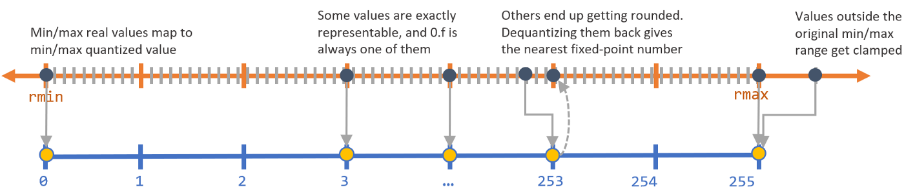

# Lab 6. Magic

<p align="center">
  
</p>

Достаточно решить любую задачу без звёздочки.


## Задача 1 («‎Библиотека»‎)

В библиотеках хранятся книги.
У каждой книги есть название, а также автор, и дата выпуска.
У каждой библиотеки тоже есть название.
В библиотеке может быть больше одного экземпляра книги с теми же названием и автором.
Надо определить классы для *Книги* и *Библиотеки*.

При этом должна быть возможность добавить книгу в библиотеку с помощью операции `+`.
При сложении библиотеки и книги получается новая библиотека с тем же названием, что у библиотеки-слагаемого, но у которой среди книг есть ещё одна — книга-слагаемое.
Например:
```python
biblio = Library(name="Библиотека МФТИ")
book = Book(
    name="Теоретическая физика. Том 1. Механика",
    author="Ландау Л.Д., Лифшиц Е.М.",
    year=2004
)

biblio = biblio + book
# Теперь в библиотеке biblio есть одна книга
```

Должна быть возможность сравнить две библиотеки: считается, что одна библиотека "больше" другой, если в ней больше книг.
Две библиотеки равны, если в них содержатся одинаковые наборы книг
(книги, в свою очередь, считаются одинаковыми, если у них одинаковые названия и автор).
Например:
```python
biblio1 = Library(name="Библиотека МФТИ")
biblio2 = Library(name="Ленинка")
book = Book(
    name="Теоретическая физика. Том 1. Механика",
    author="Ландау Л.Д., Лифшиц Е.М.",
    year=2004
)

biblio1 = biblio1 + book
biblio2 = biblio2 + book

print(biblio1 > biblio2)   # False
print(biblio1 == biblio2)  # True, так как 1 == 1

biblio1 += book

print(biblio1 > biblio2)   # True, так как 2 > 1
print(biblio1 == biblio2)  # False
```

У библиотеки должен быть "читаемый" вывод как при использовании `print`.
Например:
```python
biblio = Library(name="Библиотека МФТИ")
book = Book(
    name="Теоретическая физика. Том 1. Механика",
    author="Ландау Л.Д., Лифшиц Е.М.",
    year=2004
)

biblio = biblio + book

print(biblio)  # Библиотека МФТИ (число книг: 1)
```
Так и при "выводе в ячейке".
Например (для библиотеки из предыдущего примера):
```python
print(repr(biblio))  # Library(name="Библиотека МФТИ")
```


## Задача 2 («‎ℚ»‎)

Нужно определить класс *Рационального числа*: в классе должны быть методы по сложению, вычитанию, умножению и делению рациональных чисел.
Также должен быть метод по переводу рационального числа в обычное `float` число (например объект, представляющий число `1/8` должен отобразиться в `0.125`).
И ещё надо реализовать *классовый* метод по созданию объекта рационального числа из строки вида `"n/m"` (например `"3/4"`).
Например:
```python
r1 = Rational(1, 2)
r2 = Rational(-1, 2)

print(r1 * r2)    # -1/4
print(float(r1))  # 0.5

print(Rational.from_string('3/4'))  # 3/4
```

Напишите тест (в виде отдельной функции), в котором надо создать два рациональных числа и проверить операции сложения, вычитания, деления и умножения на их примере.
Напишите тест для проверки перевода рационального числа во `float` число.
И тест для проверки создания рационального числа по строке.

То есть весь код в итоге должен выглядеть как-то так:
```python
class Rational:
    pass  # TODO: code here


def test_operations():
    pass  # TODO: test here


def test_cast_to_float():
    pass  # TODO: test here


def test_parse_from_string():
    pass  # TODO: test here


if __name__ == '__main__':
    test_operations()
    test_cast_to_float()
    test_parse_from_string()
```

### P.S.

Проверки внутри, например, `test_operations` можно делать с помощью `assert`:
```python
assert Rational(1, 2) + Rational(1, 2) == Rational(1, 1)
```


## Задача 3 («Вычеты по модулю n»‎)

Модульная арифметика — операции с остатками по некоторому модулю.
Например, *по модулю `3`* пятёрка — это то же самое, что и двойка.
Потому что у них совпадают остатки от деления на `3` (в обоих случаях остаток равен `2`, так как `5 - 2 = 3` — кратно `3`, и `2 - 2 = 0` — тоже кратно `3`).
Всего, очевидно, есть `n - 1` различных остатков по модулю`n`.
Например, остатки по модулю `3` — это `0`, `1` и `2`.

Надо реализовать класс `Residue` остатка по модулю `n`.
Должна быть возможность сравнения на равенство остатков *по одному и тому же модулю*.
Также должны быть реализованы следующие операции с объектами остатков по одному и тому же модулю:
* сложение
* вычитание
* умножение

При попытке выполнить любую из описанных операций с остатками по разным модулям должна выбрасываться ошибка `TypeError`.

Ещё надо сделать так, чтобы было понятное и "читаемое" описание объекта остатка при выводе на экран (через функцию `print` или просто при вызове в ячейке Юпитер-ноутбука).

Возможный пример работы:
```python
r1 = Residue(2, mod=3)
r2 = Residue(5, mod=3)

print(r1)        # 2 (mod 3)
print(r2)        # 2 (mod 3)
print(r1 == r2)  # True
print(r1 + r2)   # 1 (mod 3)
print(r1 - r2)   # 0 (mod 3)
```


## Задача 4 («‎CustomDict»‎)

Реализуйте свой словарь (назовём его, например, `CustomDict`).
Он должен поддерживать методы, которые есть в обычном Python словаре (и у него должен быть читаемый вывод на экран; например, такой же, как и у обычного словаря):
```python
data = CustomDict()

data['johnny'] = 'depp'
data['margot'] = 'robbie'
 
print(data)       # {'johnny': 'depp', 'margot': 'robbie'}
print(len(data))  # 2

del data['johnny']
 
print(len(data))        # 1
print('johnny' in data) # False
print('margot' in data) # True
```

Помимо функционала обычного словаря, надо реализовать сложение объектов типа `CustomDict` с помощью оператора `+`: словарь-результат типа `CustomDict` должен содержать все ключи, которые есть в первом и втором словарях, при этом значения по общим ключам должны совпадать со значениями из второго словаря
(то есть суть операции `+` в том, что прибавляемый словарь *обновляет и дополняет* информацию в первом словаре).
При этом в качестве второго операнда может выступать и обычный Python словарь.
Например:
```python
data1 = CustomDict(a=1)
data2 = CustomDict(b=2)

print(data1 + data2)     # {'a': 1, 'b': 2}
print(data1 + {'b': 2})  # {'a': 1, 'b': 2}
```

Также надо написать классовый метод `CustomDict.from_default`, который создаёт объект класса `CustomDict` по обычному словарю:
```python
data = CustomDict.from_default({'time': '23:29', 'doing': 'writing hw'})

print(data)  # {'time': '23:29', 'doing': 'writing hw'}
```


## Задача 5 («Точки в полярных координатах»‎)

Надо реализовать класс `Point` для представления точек в [полярной системе координат](https://en.wikipedia.org/wiki/Polar_coordinate_system) на плоскости.
Точка в порярной системе координат определяется расстоянием до полюса *r* и углом *φ* между направлением на точку из полюса и заранее выбранным направлением **l**.
Расстояние будем считать безразмерным, а угол — выраженным в градусах.
Например, создание объекта, представляющего точку, удалённую от полюса на расстояние 10 под углом в 30 градусов:
```python
p = Point(r=10, phi=30)
```

Должна быть возможность складывать точки.
При сложении двух точек складываются их радиусы-векторы по правилу сложения векторов.
И координатами точки-результата будут: длина результирующего вектора и угол, который он образует с направлением **l**.
Например:
```python
p1 = Point(r=1, phi=0)
p2 = Point(r=1, phi=90)
p3 = p1 + p2
# p3 — точка с r = 1.41 (примерно) и phi = 45
```

Также должна быть возможность создать объект точки не только по радиусу и углу, но и по "обычным" координатам.
То есть по координатам точки в декартовой прямоугольной системе координат, начало которой совпадает с началом полярной системы, а ось OX сонаправлена с **l**.
Например:
```python
p = Point.from_cartesian(x=-17.5, y=0)
# Создаётся точка с r = 17.5 и phi = 180
```

У точки `Point` должно быть понятное представление как при выводе с помощью `print`.
Например:
```python
p = Point(1, 10)

print(p)  # (r = 1, φ = 10)
```
Так и при "выводе в ячейке".
Например:
```python
p = Point(1, 10)

print(repr(p))  # Point(1, 10)
```

Также должна быть возможность проверить две точки на равенство.
Объекты класса `Point` точки `p1` и `p2` равны, если они представляют одну и ту же точку плоскости:
```python
p1 = Point(1, 120)
p2 = Point(1, 480)

print(p1 == p2)  # True
```


## Задача 6 («‎SortedDict»‎)

Обычные словари в Питоне (по крайней мере до определённой версии языка) не гарантировали никакого порядка на ключах.
Это значит, что, например, если записать в словарь сначала некоторое значение под ключом `k1`, а потом значение под ключом `k2`, то это не обязательно означает, что в словаре `k1` идёт перед `k2`.

Реализуйте словарь, где *ключи всегда будут упорядочены* (назовём его`SortedDict`).

Он должен поддерживать методы, которые есть в обычном Python словаре (и у него должен быть читаемый вывод на экран; например, такой же, как и у обычного словаря):
```python
data = SortedDict()

data['b'] = 'margot robbie'
data['a'] = 'johnny depp'
 
print(data)       # {'a': 'johnny depp', 'b': 'margot robbie'}
print(len(data))  # 2

del data['a']
 
print(len(data))    # 1
print('a' in data)  # False
print('b' in data)  # True
```

Также надо написать классовый метод `SortedDict.from_default`, который создаёт объект класса `SortedDict` по обычному словарю:
```python
data = SortedDict.from_default({'time': '23:29', 'doing': 'writing hw'})

print(data)  # {'doing': 'writing hw', 'time': '23:29'}
```


## Задача 7 («Chemistry»‎)

*Далее постановка "специально" сильно упрощена 😅*

Будем считать, что есть *вещества*, способные вступать в реакцию друг с другом.
И есть *индикаторы*, по-разному действующие на каждое вещество.

Под веществами будем иметь в виду кислоту `Acid`, соль `Salt`, основание `Base` и воду `Water`.
Индикаторы — фенолфталеин `Phenolphthalein`, лакмус `Litmus` и метилоранж `MethylOrange`.
Индикатор определяется цветом (по умолчанию — бесцветный).

Пусть все возможные реакции между описанными веществами сводятся к следующему:
* Кислота + Основание -> Соль + Вода
* Соль + Кислота -> Соль + Кислота (новые)
* Соль + Основание -> Соль + Основание (новые)

И с индикаторами:
* Кислота + Фенолфталеин -> Фенолфталеин(бесцветный)
* Кислота + Лакмус -> Лакмус(красный)
* Кислота + Метилоранж -> Метилоранж(розовый)
* Основание + Фенолфталеин -> Фенолфталеин(малиновый)
* Основание + Лакмус -> Лакмус(синий)
* Основание + Метилоранж -> Метилоранж(жёлтый)

Надо реализовать описанные классы.
Операция реакции — через оператор `+`.
В результате реакции получается *кортеж* из веществ.
Если реакция не входит в число описанных выше (например, `Соль + Соль`), то надо бросать исключение `TypeError`.

Пример работы:
```python
acid = Acid()
base = Base()

reaction_products = acid + base

print(reaction_products)  # (Соль, Вода)

salt = reaction_products[0]

print(base + salt)  # (Основание, Соль)

methyl_orange = MethylOrange()

print(methyl_orange)  # (Метилоранж(бесцветный),)
print(methyl_orange + acid)  # (Метилоранж(розовый),)
```


## Задача 8 («Небо»‎)

В разное время дня небо разного цвета.
Если на небе есть облака, то яркость цвета уменьшается.
Если же на небе много *грозовых* облаков, то оно становится серым...
Но со временем облака уходят, и небо проясняется.

Надо реализовать классы неба `Sky`, облака `Cloud` и грозового облака `StormCloud`.
Небо определяется цветом, яркостью и количеством облаков разного вида на нём в текущий момент времени.
Будем считать, что цвет неба меняется в зависимости от времени суток следующим образом:
* утро — `#ffe4be`
* день — `#00bcff`
* вечер — `#d772ee`
* ночь — `#230b28`

Яркость положем числом от `0` до `1` (максимальная яркость).

Облака характеризуются "временем жизни": спустя этот интервал времени облако "уходит с неба".
Время жизни облака измеряется в минутах и по умолчанию составляет `10` минут.
Каждое обычное облако уменьшает яркость неба на `0.1`.
Каждое грозовое облако уменьшает яркость на `0.2`.
Если же грозовых облаков на небе становится не меньше трёх, то цвет неба становится серым `#8e8a8f`.

Облака должны "приходить" не небо с помощью оператора `+`.
У облаков и неба должно быть понятное представление при `print` и просто при "вызове в ячейке".

Пример работы:
```python
# Утро.

sky = Sky()

print(sky)  # Небо цвета #ffe4be яркости 1

sky += Cloud()

print(sky)  # Небо цвета #ffe4be яркости 0.9

sky += StormCloud() + StormCloud() + StormCloud(lifetime=60)

print(sky)  # Небо цвета #8e8a8f яркости 0.3

# ...Прошёл день. Наступил вечер. Чистое небо.

print(sky)  # Небо цвета #d772ee яркости 1
```


## Задача 9* («‎Secret Storage»‎)

Напишите класс `Storage`, который при создании принимает на вход какую-то информацию в виде словаря.
При этом у объектов класса `Storage` должны быть приватные атрибуты `_reserve_data` и `_secret_data` — тоже словари, фиксированные.
Например, конструктор класса `Storage` может выглядеть так:
```python
from typing import Any, Dict


class Storage:
    def __init__(self, data: Dict[str, Any]):
        self._data = data
        self._reserve_data = {
            "potato": 100,
        }
        self._secret_data = {
            "supplier": "johnny",
        }
```

Надо сделать так, чтобы можно было обращаться по ключу к объекту класса `Storage`. При этом
* если ключ есть в `_data`, то должно возвращаться значение из переданного при создании объекта словаря
* если ключа нет в `_data`, то должен произойти поиск ключа в `_reserve_data`, и, если ключ есть там, возвращается соответствующее значение из `_reserve_data`
* если же ключа нет ни в `_data`, ни в `_reserve_data`, то должна выбрасываться ошибка `KeyError`

Ещё надо сделать так, чтобы был закрыт доступ извне к `_secret_data` — на то она и "secret" :)
```python
storage = Storage({'apple': 2})

print(storage['apple'])     # 2
print(storage['potato'])    # 100
print(storage['supplier'])  # Возникает ошибка KeyError

storage._secret_data        # Возникает ошибка AttributeError
```


## Задача 10* («Квантованный список»‎)

О *квантизации* можно думать как о переводе числа из типа `float32` в `int` (int16/int8/int4/int2).
То есть из "непрерывного" типа в дискретный.

<p align="center">
  <a href="https://github.com/DeqingSun/Machine-Learning-Experiment-on-8-bit-Arduino#quantization">
    
  </a>
</p>
<p align="center">
  <em>Идея квантизации — дискретизация ("ещё большая").</em>
</p>

Квантизация может использоваться для уменьшения размера данных.
Ещё одно из возможных применений квантизации — ускорение вычислений: некоторые операции с квантованными матрицами могут исполняться быстрее, чем с матрицами в полной точности float32 (правда, на практике ещё важно, чтобы процессор поддерживал эти самые более оптимальные варианты операций).

Существует несколько способов, "стратегий" квантизации.
Рассмотрим следующий ("без наворотов").
Пусть есть список `values` чисел в точности `float` и флотовый же множитель `alpha`.
Тогда для того, чтобы построить *квантованный список*, надо для каждого числа `x` из `values` сделать следующее (псевдокод предлагаемого алгоритма квантизации): 
```python
# Вход: x (float), alpha, num_bits
# Выход: x_quant (int)

# Делим на alpha, чтобы прийти к некоему компромиссу между
# потерями при квантизации, то есть числом "клэмпнутых" значений
#     (малые потери при больших alpha — хорошо)
# и точностью квантизации, то есть разницей между оригинальным float и квантованным int числом
#     (малая точность при больших alpha — плохо)
x_scaled = x / alpha

# Собственно "клэмп" ("обрезание" тех значений, что за пределами),
# чтобы потом фиксированный отрезок [-1, 1] перевести в отрезок [min_int, max_int]
x_clamped = x_scaled.clamp(min=-1, max=1)

# Сохраняем знак числа (на это понадобится один бит)
sign = x_clamped.sign()
x_abs = x_clamped.abs()

# Квантование
x_quant = x_abs.mul(2 ** num_bits - 1)
x_quant = x_quant.round()
```

Чтобы потом получить из квантованного `x` флотовое значение, надо провести "деквантизацию":
```python
# Переводим в [-1, 1]
x = x_quant.div(2 ** num_bits - 1)

# Восстанавливаем знак
x = sign * x

# Переводим в нужные пределы
x = x * alpha
```

Итак, в задании требуется реализовать класс квантованного списка значений `QuantVector`.
Должна быть возможность сложения двух списков с помощью оператора `+`.
За множитель `alpha` при квантизации можно положить, например, просто максимальное флотовое значение в списке.
Если размеры складываемых списков отличаются, то надо бросить исключение `ValueError`.

Возможный пример работы:
```python
vec1 = QuantVector(values=[-17.5, 0.01, 2022], num_bits=4)
vec2 = QuantVector(values=[2.1, 2.49, 2.001], num_bits=4)

print(vec1)         # [-8, 0, 8] (qint4)
print(vec2)         # [2, 2, 2] (qint4)
print(vec1 + vec2)  # [-8, 3, 8] (qint4)
```
