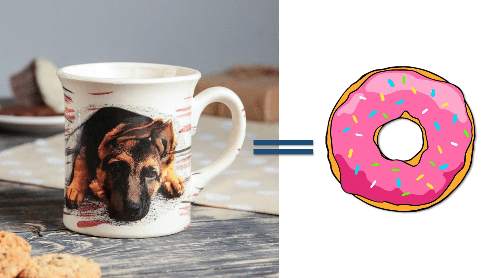

# Lab 7. Abstraction

<p align="center">
  
</p>

В качестве задания предлагается посмотреть последнее упражнение к [лабе про абстрактные методы и классы](http://cs.mipt.ru/advanced_python/lessons/lab07.html) (про ДНК).


## Задача 1 («‎ДНК»‎)

Реализуйте классы для ДНК (двойная цепочка) и РНК (одинарная цепочка).

Указанные структуры данных должны поддерживать следующие возможности[^1]:

1. Создание структуры из строк. Обратите внимание, что в ДНК встречаются только азотистые основания *ATGC*, а в РНК — *AUGC*, поэтому, если во входной строке содержатся другие символы, необходимо поднимать ошибку (`Exception`).
2. Поддержка индексации: РНК по индексу возвращает `i`-ое азотистое основание, ДНК — *пару* азотистых оснований (соответствующие первой и второй цепочке).
3. РНК может возвращать комплементарную ДНК (каждому азотистому основанию из РНК соответсвует основание для первой цепочки ДНК: *A* → *T*, *U* → *A*, *G* → *C*, *C* → *G*; вторая цепочка ДНК строится комплементарной первой строчке ДНК: *A* → *T*, *T* → *A*, *G* → *C*, *C → G*).
4. РНК, как и ДНК, могут складываться путем склеивания:
  ```python
  "AUUGAACUA" + "CGGAAA" = "AUUGAACUACGGAAA"
  ```
  У ДНК склеиваются соответствующие цепочки:
  ```python
  ["ACG", "TGC"] + ["TTTAAT", "AAATTA"] = ["ACGTTTAAT", "TGCAAATTA"]
  ```
5. РНК могут перемножаться друг с другом: каждое азотистое основание результирующей РНК получается случайным выбором одного из двух соответсвующих родительских азотистых оснований. Если одна из цепочек длиннее другой, то перемножение происходит с начала, а когда одна из цепочек закончится, оставшийся хвост другой переносится без изменений.
6. ДНК могут перемножаться друг с другом: **первые** цепочки каждой из ДНК перемножаются по такому же принципу, как перемножаются РНК. Вторая цепочка результирующей ДНК строится как комплементарная первой.
7. Две РНК и две ДНК можно проверять на равенство.
8. Оба класса должны давать осмысленный вывод как при `print`, так и просто при "вызове в ячейке".

Обдумайте и создайте необходимые и, возможно, вспомогательные классы, настройте наследование, если требуется.
Полученная структура данных должна быть адекватной и удобной, готовой к простому расширению функционала, если потребуется.


[^1]: Автор данной страницы не в курсе, есть ли у всех описанных в задаче операций между объектами классов РНК и ДНК реальные аналоги — операции между молекулами РНК и ДНК. Поэтому рекомендуется к условию относиться критически и рассматривать его в первую очередь просто как задачку по ООП, но в "биодекорациях")
