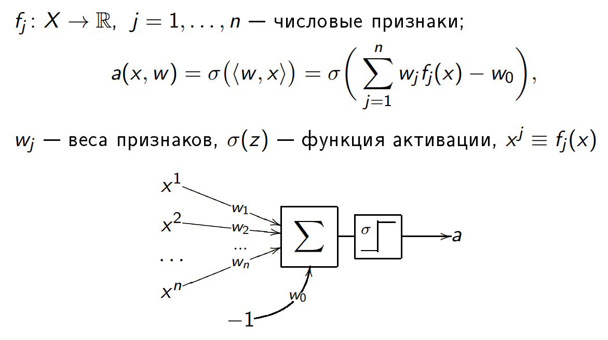
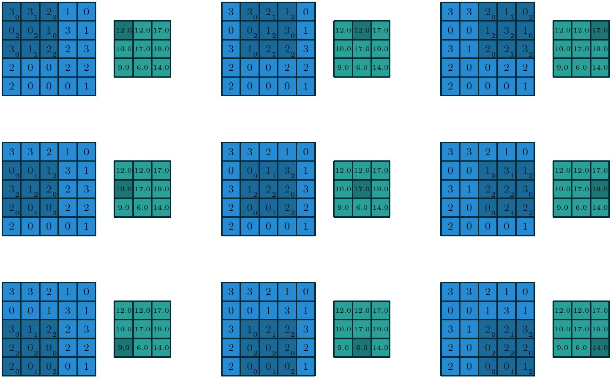
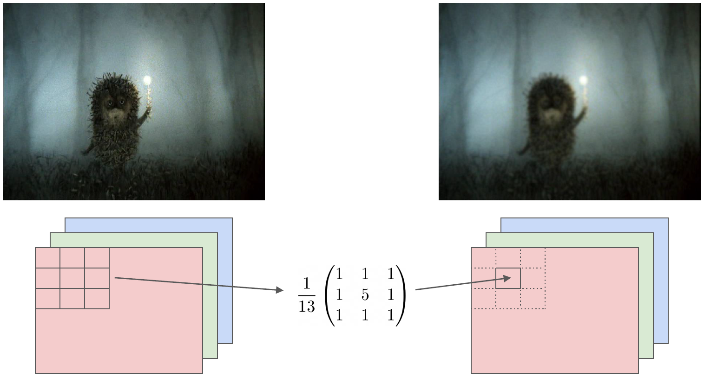

# Lab 16. NumPy («Нам-Пай» / «Нам-Пи»)

* В качестве задания по `numpy` предлагается решить все "основные" задания (без звёздочек).
* Оформлять можно в .ipynb ноутбуке: кажется, в данном случае это в целом наболее удобный вариант.
* Во всех заданиях (включая задания после первого, но и в первом тоже) нельзя использовать циклы: только функционал `numpy` (работа с векторами и матрицами).


## Задание 1

Последнее из [лабы](http://cs.mipt.ru/advanced_python/lessons/lab16.html).
Ниже приведена копия условия с сайта.

Рассмотрим функцию f на отрезке [1, 15]:

<!--  -->

<p align="center">
    
</p>

<p align="center">
    
</p>

Она может описывать, например, зависимость оценок, которые выставляют определенному сорту вина эксперты, в зависимости от возраста этого вина.
Мы хотим приблизить сложную зависимость с помощью функции из определенного семейства.
В этом задании мы будем приближать указанную функцию с помощью многочленов.

Как известно, многочлен степени `n` (то есть w<sub>0</sub> + w<sub>1</sub> x + w<sub>2</sub> x<sup>2</sup> + ... + w<sub>n</sub> x<sup>n</sup>) однозначно определяется любыми n + 1 различными точками, через которые он проходит.
Это значит, что его коэффициенты w<sub>0</sub>, ..., w<sub>n</sub> можно определить из следующей системы линейных уравнений:

<p align="center">
    
</p>

где через x<sub>1</sub>, ..., x<sub>n</sub>, x<sub>n + 1</sub> обозначены точки, через которые проходит многочлен, а через f(x<sub>1</sub>), ..., f(x<sub>n</sub>), f(x<sub>n&nbsp;+&nbsp;1</sub>) — значения, которые он должен принимать в этих точках.

Воспользуемся описанным свойством, и будем находить приближение функции многочленом, решая систему линейных уравнений.

1. Сформируйте систему линейных уравнений (то есть задайте матрицу коэффициентов A и свободный вектор b) для многочлена первой степени, который должен совпадать с функцией f в точках 1 и 15. Решите данную систему с помощью функции `numpy.linalg.solve`. Нарисуйте функцию f и полученный многочлен. Хорошо ли он приближает исходную функцию?
2. Повторите те же шаги для многочлена второй степени, который совпадает с функцией f в точках 1, 8 и 15. Улучшилось ли качество аппроксимации?
3. Повторите те же шаги для многочлена третьей степени, который совпадает с функцией f в точках 1, 4, 10 и 15. Хорошо ли он аппроксимирует функцию? Коэффициенты данного многочлена (четыре числа в следующем порядке: w<sub>0</sub>, w<sub>1</sub>, w<sub>2</sub>, w<sub>3</sub>) являются ответом на задачу. Округлять коэффициенты не обязательно, но при желании можно произвести округление до второго знака (т.е. до числа вида 0.42).


## Задание 2

Есть два вектора одинаковой длины: `x` и `y`.
Надо найти количество позиций, для которых элементы в обоих векторах ненулевые.
Число позиций, для которых хотя бы в одном из двух векторов `x` и `y` есть ненулевой элемент.

Например:
```
x = [1, 0, 1, 1, 0, 1, 1]
y = [0, 2, 0, 2, 0, 2, 0]

Answer: 2, 6
```


## Задание 3

В векторе `x` надо повторить каждый элемент `N` раз подряд.

Например:
```
x = [1, 2, 0], N = 3

Answer: [1, 1, 1, 2, 2, 2, 0, 0, 0]
```


## Задание 4

В векторе `x` надо найти максимальный элемент среди тех, перед которыми стоит
ноль.

Например:
```
x = [0, 11, 0, 0, -7, 2, 0, 4, 0]

Answer: 11
```


## Задание 5

В векторе `x` надо заполнить каждый нулевой элемент предыдущим ненулевым
значением.

Например:
```
x = [8, 0, 0, 1, 0, 0, 0, -17.5, 0]

Answer: [8, 8, 8, 1, 1, 1, 1, -17.5, -17.5]
```


## Задание 6

Надо вычислить приближённое значение функции
f(x)&nbsp;=&nbsp;ln(1 + x)
в точке x<sub>0</sub> с помощью разложения в ряд Тейлора N-го порядка в окрестности нуля:

<p align="center">
    
</p>


## Задание 7

Дана матрица X «объекты-признаки» размера m&nbsp;x&nbsp;n:
число строк m — это количество объектов,
а число столбцов n — количество признаков.
Каждая строка представляет собой описание объекта выборки в виде набора значений его признаков.
Каждый же столбец содержит значения определённого признака на всех объектах выборки.

Например, матрица X, соответствующая некоторой совокупности из трёх объектов с двумя признаками:
```
    ┌        ┐
    │ 175  4 │
X = │  20  2 │
    │  25  8 │
    └        ┘
```

(где первый столбец может представлять, например, "рост" в сантиметрах,
а второй столбец — количество "конечностей")

Надо найти выборочное среднее и ковариационную матрицу выборки X,
не пользуясь специальными `numpy` функциями `mean` и `cov`.


## Задание 8* (LSTM)

Один из самых базовых элементов искусственных нейронных сетей — нейрон:
<p align="center">
    
</p>
<p align="center">
	<em>
	Нейрон — линейная функция + нелинейность (<a href="https://en.wikipedia.org/wiki/Activation_function#Table_of_activation_functions"><em>функция активации</em></a>, например, сигмоида.).
	</em>
</p>

Нейрон является компонентом более сложных элементов нейросетей.
Например, [Long Short-Term Memory (LSTM)](https://en.wikipedia.org/wiki/Long_short-term_memory) блока, являющегося популярной архитектурой для обработки последовательностей ([RNN — Recurrent Neural Network](https://en.wikipedia.org/wiki/Recurrent_neural_network)).

Напишите с помощью `numpy` функцию вида:
```python
from numpy import array

def lstm(input: array) -> array:
    pass
```

Которая должна быть реализацией [формулы LSTM](https://en.wikipedia.org/wiki/Long_short-term_memory#LSTM_with_a_forget_gate):
<p align="center">
    
</p>
<p align="center">
	<em>
	Вычисления в LSTM: сложение, умножение матриц ("обычное"); поэлементное умножение матриц; несколько видов нелинейности.
	</em>
</p>


## Задание 9* (CNN)

О [матричной операции *свёртки*](https://en.wikipedia.org/wiki/Convolution#Discrete_convolution) можно думать как об операции, принимающей не вход две матрицы и возвращающей третью.
Входные матрицы — это собственно "input" матрица (например, RGB изображение как матрица размера "число каналов, то есть 3" X "высота" X "ширина") и так называемая ["kernel" или "filter" матрица](https://stats.stackexchange.com/a/188216/271863).
Выходная "output" матрица получается как бы "скольжением" фильтра по оригинальной матрице.

<p align="center">
    
</p>
<p align="center">
	<em>
	Фильтр словно двигается над входной матрицей и на каждом шаге поэлементно умножается на находящуюся под ним подматрицу, элементы произведения складываются, и результат записывается как элемент выходной матрицы (<a href="https://arxiv.org/abs/1603.07285">источник картинки</a>).
	</em>
</p>

От фильтра (и [деталей того, как именно он "скользит" над оригинальным изображением](https://github.com/vdumoulin/conv_arithmetic)) зависят свойства получающейся на выходе матрицы.
Так, матрица после свёртки может представлять собой ту же картинку, но с большей резкостью или, наоборот, размытую.

В данном задании предлагается реализовать с помощью библиотеки `numpy` функцию вида:
```python
def blur(input_path: str, output_path: str) -> None:
    pass
```
которая принимает на вход путь `input_path` до RGB изображения, а в качестве результата записывает под путём `output_path` соответствующее размытое изображение, полученное как свёртка с каким-нибудь размывающим фильтром.

<p align="center">
    
</p>
<p align="center">
	<em>
	Возможное "размытие" на примере Ёжика.
	</em>
</p>


# Ссылки

* [NumPy Broadcasting](https://numpy.org/doc/stable/user/basics.broadcasting.html): не обязательно приводить тензоры к одинаковым размерностям при сложении и поэлементном умножении
* [NumPy Indexing](https://numpy.org/doc/stable/reference/arrays.indexing.html): не всегда подматрица — ссылка на тот же кусок исходной матрицы (также см. про `flatten`, `ravel` и `reshape`)
