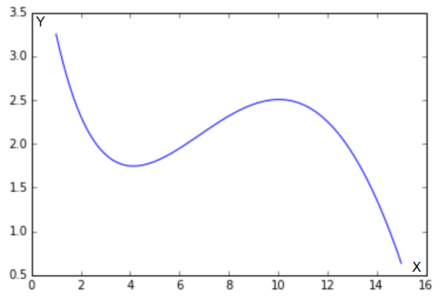

# Lab 16. NumPy («Нам-Пай» / «Нам-Пи»)

Все задания можно оформить в .ipynb ноутбуке: кажется, в данном случае это более подходящий вариант оформления.

## Задание 1

Последнее из [лабы](http://cs.mipt.ru/advanced_python/lessons/lab16.html).

Рассмотрим следующую функцию на отрезке [1, 15]:

Она может описывать, например, зависимость оценок, которые выставляют определенному сорту вина эксперты, в зависимости от возраста этого вина.
Мы хотим приблизить сложную зависимость с помощью функции из определенного семейства.
В этом задании мы будем приближать указанную функцию с помощью многочленов.

Как известно, многочлен степени `n` (то есть w0 + w1 x + w2 x2 + ... + wn xn) однозначно определяется любыми n + 1 различными точками, через которые он проходит.
Это значит, что его коэффициенты w0, ..., wn можно определить из следующей системы линейных уравнений:

где через x1, ..., xn, xn + 1 обозначены точки, через которые проходит многочлен, а через f(x1), ..., f(xn), f(xn&nbsp;+&nbsp;1) — значения, которые он должен принимать в этих точках.

Воспользуемся описанным свойством, и будем находить приближение функции многочленом, решая систему линейных уравнений.

1. Сформируйте систему линейных уравнений (то есть задайте матрицу коэффициентов A и свободный вектор b) для многочлена первой степени, который должен совпадать с функцией f в точках 1 и 15. Решите данную систему с помощью функции scipy.linalg.solve. Нарисуйте функцию f и полученный многочлен. Хорошо ли он приближает исходную функцию?
2. Повторите те же шаги для многочлена второй степени, который совпадает с функцией f в точках 1, 8 и 15. Улучшилось ли качество аппроксимации?
3. Повторите те же шаги для многочлена третьей степени, который совпадает с функцией f в точках 1, 4, 10 и 15. Хорошо ли он аппроксимирует функцию? Коэффициенты данного многочлена (четыре числа в следующем порядке: w0, w1, w2, w3) являются ответом на задачу. Округлять коэффициенты не обязательно, но при желании можно произвести округление до второго знака (т.е. до числа вида 0.42).

