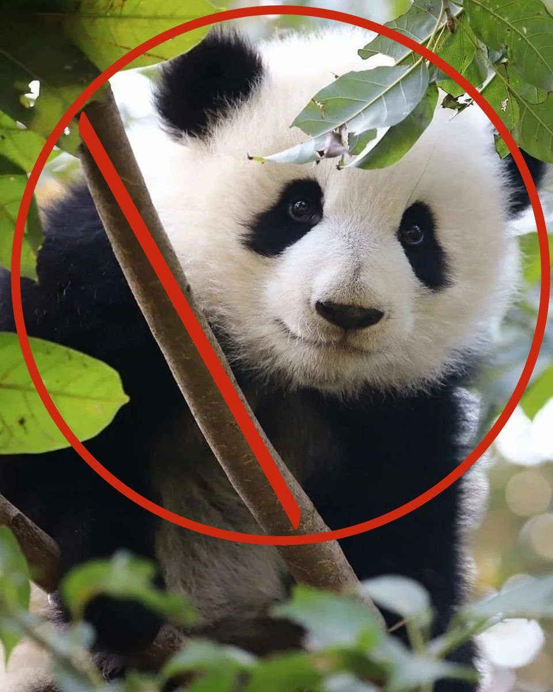

# Lab 17. Pandas

<!--
https://stackoverflow.com/questions/24319505/how-can-one-display-images-side-by-side-in-a-github-readme-md
-->

    
    

В качестве задания предлагается посмотреть контест в конце соответствующей [лабы](http://cs.mipt.ru/advanced_python/lessons/lab17.html).
Достаточно решить любые три задачи из пяти и оформить решения в виде отдельного пулл-реквеста.
