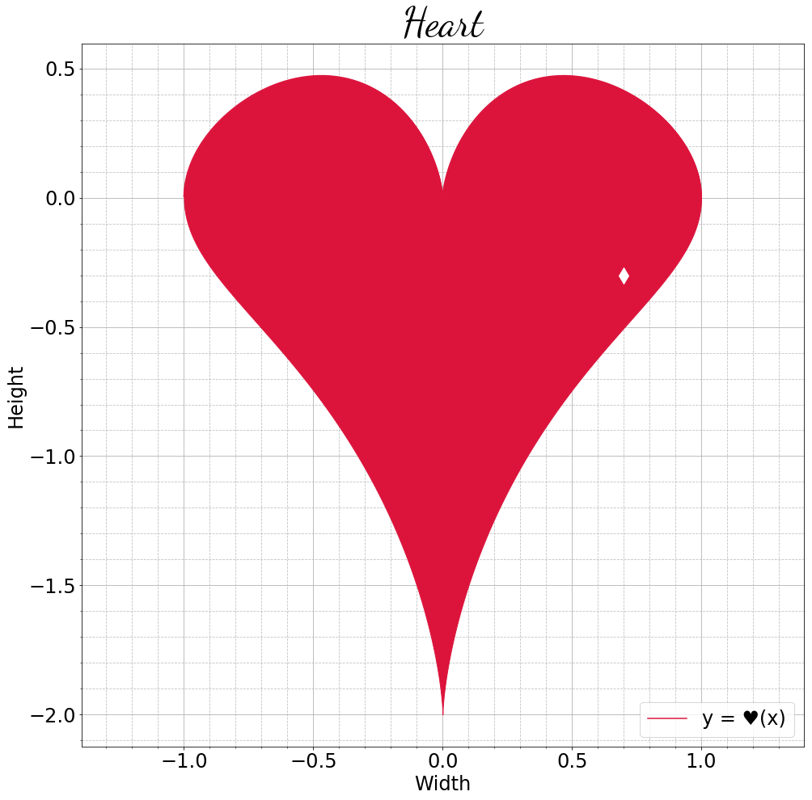
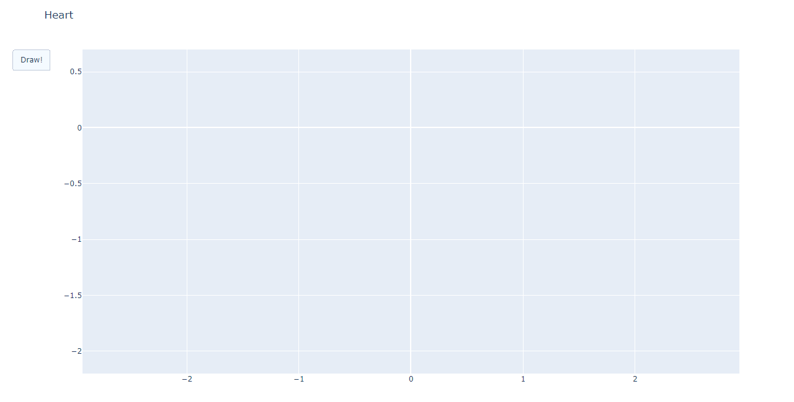

# Lab 18. plt, mpl, sns, and pd

В качестве задания предлагается оформить ноутбук с исследованием данных по плану из лабы.

## Задание 1

Данные доступны в [репозитории](https://github.com/Laggg/data--for--students) (табличка *flight_delays.csv*).

Для каждой задачи надо получить ответ на вопрос через *pandas* и визуализировать его любым подходящим способом (у всех графиков должна быть легенда, подписаны оси). Надо найти
* долю всех задержек ко всем вылетам
* зависимость количества задержек от длины пути, который предстоит пролететь самолёту
* топ 5 направлений, для которых чаще всего происходят задержки
* в какие времена года чаще всего происходят задержки рейсов
* топ 10 самых хороших перевозчиков, которые реже всего задерживают свои рейсы
* топ 10 самых безответственных аэропортов, в которых чаще всего происходят задержки
* необычную зависимость количества задержек от имеющихся данных

## Задание 2*

Использовать библиотеку [Plotly](https://plotly.com/python/) для визуализации данных в предыдущем задании.

## Задание 3* (Heart 1)

Надо нарисовать с помощью `matplotlib` график, максимально похожий на следующий:

  

## Задание 4* (Heart 2)

Надо нарисовать график следующего вида (с анимацией):

<!-- https://html5animationtogif.com/ -->
<!-- https://ezgif.com/crop -->

   

Рисовать надо в Питоне.
Формат файла с графиком может быть любым (но это должен быть один читаемый файл).

# Ссылки

* Про метод понижения размерности PCA (Principal Component Analysis) можно почитать [тут](http://www.machinelearning.ru/wiki/images/a/a2/Voron-ML-regression-slides.pdf). TL;DR старые признаки линейно восстанавливаются по новым; при этом разброс данных по новым признакам оказывается максимальным.
* Про другой метод понижения размерности, t-SNE (t-distributed Stochastic Neighbor Embedding), можно почитать [тут](http://www.machinelearning.ru/wiki/images/9/98/Voron-ML-Embeddings-slides.pdf). TL;DR попарные расстояния между объектами в новом признаковом пространстве (с меньшей размерностью) должны быть похожи на расстояния между теми же объектами в старом пространстве.
* Графики можно строить не только в Питоне. Например, можно пользоваться Excel 🤓 или [D3.js](https://d3js.org/) 🤯.
* Для исследования графиков функций, заданных аналитически, кажется, больше подходят специальные инструменты, например [Desmos](https://www.desmos.com/).
* Сабреддит про визуализацию данных [r/dataisbeautiful](https://www.reddit.com/r/dataisbeautiful/).
* Визуализации данных посвящены отдельные исследования, конференции. Например, [https://vizbi.org/Posters/2018/Y03](https://vizbi.org/Posters/2018/Y03).
