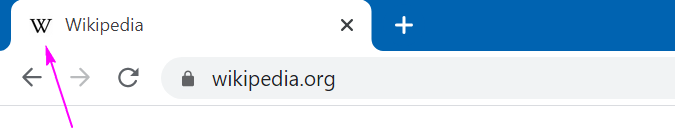
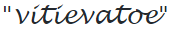

# Lab 21. Web: HTML, CSS & JS

Structure, style, and "behaviour" — one Web to rule them all...

["Простое" демо](./demo/simple_demo) (кликнуть на HTML, чтоб открыть файл в браузере).
["Продвинутое" демо](./demo/server_demo) (сервер на flask-е, доступный локально по определённому порту).

## Задание 1

Вновь предлагается в качестве основного задания сделать (доделать) план по лабе.
По ["секретной лабе"](https://github.com/mipt-cs/course-advanced_python/blob/master/content/lab21.rst) по сайтам.

> Надо разработать структуру персонального сайта-визитки.
И создать сайт, подготовив .html (и, возможно, .css) страницы и подняв это всё с помощью Flask.

То есть базово сайт может быть совсем простой (Home page: "My name is Olya, I am 22 years old").

Далее, "за дополнительные плюсики" можно кое-как поулучшать этот сайт визитку:
* добавить на страницу своё фото (визитка как-никак 🙂)
* придумать где-нибудь какой-нибудь содержательный список (нумерованный или нет)
* добавить, например, ещё хотя бы одну страницу, помимо Home page/index.html (можно сделать страничку CV и вставить на неё ссылку на Home page)
* сделать, чтобы на вкладке сайта в браузере, помимо заголовка, отображалась бы ещё какая-нибудь иконка 

* использовать несколько видов шрифтов (что-нибудь  для заголовка, например, а основной текст — попроще)
* подобрать какой-нибудь  для фона сайта
* (\*) сделать так, чтоб цвет страницы Home page менялся каждую минуту (например, с фиолетового на зелёный)
* (\*) ещё как-нибудь "пооживлять" страницу, например, с помощью JavaScript

Будем считать, что за "просто поднять сайт" будет 1 балл, и за все улучшения (кроме (\*)) — тоже максимум суммарно 1 балл.

## P.S.

Пример, разобранный в тексте лабы, доступен по [ссылке](https://github.com/mipt-cs/course-advanced_python/blob/master/content/extra/lab19/flask_example.zip).

## P.P.S.

* Персональные сайты часто делают с помощью [GitHub Pages](https://pages.github.com) — хостинга сайтов (статических).
* При создании сайта в принципе надо не забывать, что сайт можно смотреть не только с компьютера, но и с телефона. То есть сайт — не просто информация. Отображение её на разных устройствах будет разным. Есть библиотеки, упрощающие разработку сайтов, например [Bootstrap](https://getbootstrap.com).
