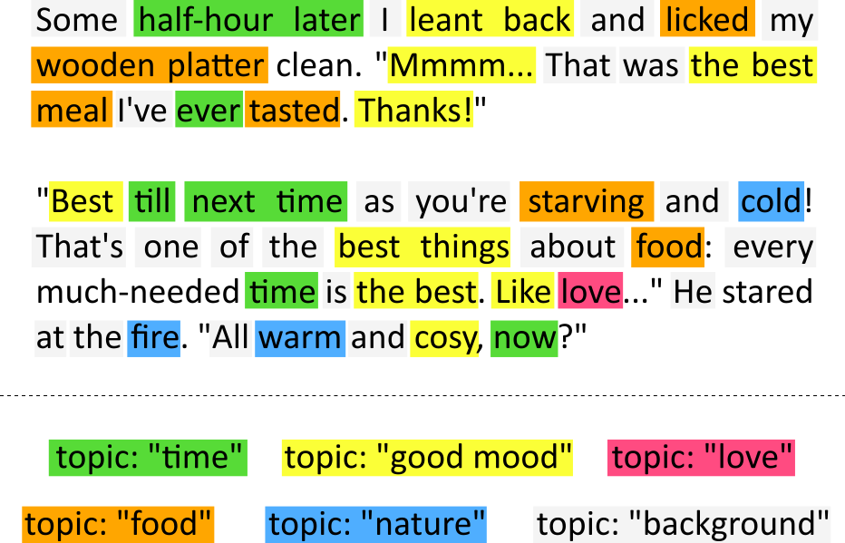

# ML5: TM

  

  <em>Возможный пример разметки текста по темам (The Unlikely Ones by Mary Brown).</em>

* Ноутбук по тематическому моделированию: https://colab.research.google.com/drive/13oUI1yxZHdQWUfmMpFY4KVlkyWzAkoky.
* Видео с разбором ноутбука (не с лабы): https://youtu.be/AIN00vWOJGw.
* Откуда получилось достать данные для ноутбука (что смотрели на лабе): [positive.csv](https://github.com/MentatRus/twitter-sentiment/blob/master/positive.csv), [negative.csv](https://github.com/MentatRus/twitter-sentiment/blob/master/negative.csv).
* Курс по тематическому моделированию (ноутбук и видео — часть курса): http://bit.ly/2EGWcjA.
